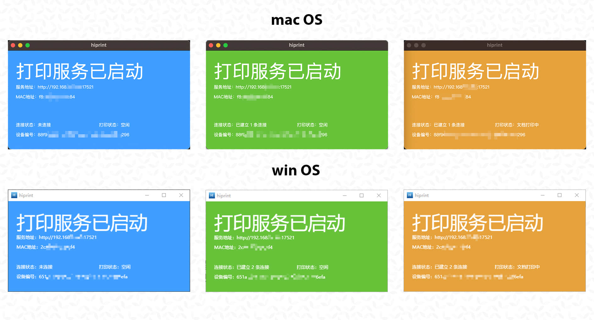
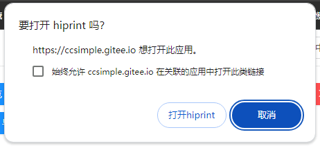

<div align="center" style="margin-top: 10px">
  <a href="http://hiprint.io/">
    
  </a>
  <a href="https://cn.vuejs.org/">
    
  </a>
</div>


<a href="https://gitee.com/CcSimple/vue-plugin-hiprint">

</a>
<a href="https://gitee.com/CcSimple/vue-plugin-hiprint">

</a>


## 关于此插件

vue-plugin-hiprint (基于 [hiprint 2.5.4](http://hiprint.io/)) 当时只是为了方便 <span style="color: red">我（并非 hiprint 原作者）</span> 在 vue 项目中引入使用，所以以此命名。

此 <span style="color: red">插件</span> 仅仅是一个 <span style="color: red">JavaScript【工具库】</span> 而非 <span style="color: yellow">Vue【组件库】</span>，所以它默认不包含 demo 中的那些组件页面（demo 代码可复制使用）。

由于 hiprint 官网最后一次更新时间为 2019 年【hiprint 2.5.4 是 [LGPL](#关于lgpl协议) 协议】，后在诸多使用者及反馈下进行了许多优化调整。

> **当前版本**：v1.0.0+，Vue 3 + Vite；已支持 25+ 项深度改进（安全、A11y、功能、API）。详见 [CHANGELOG.md](./CHANGELOG.md) 及 [docs/CODEMAPS](./docs/CODEMAPS/)。

> 📘 **业务方集成入口**：
> - **vue-admin-main 等后台项目** → [`docs/vue-admin-integration.md`](./docs/vue-admin-integration.md)（UI 100% 一致复刻指南 + 拷贝即用模板 + 4 个常见坑）
> - **完整 60+ opts 详解** → [`docs/integration-guide.md`](./docs/integration-guide.md)
> - **API 速查（23 个 export）** → [`docs/API-REFERENCE.md`](./docs/API-REFERENCE.md)
> - **CSS 体积优化（3 文件可选）** → [`docs/CSS-BUNDLE.md`](./docs/CSS-BUNDLE.md)
>
> 🔍 **业务方集成审计快照**（每次审计独立归档,按日期命名）：
> - [`docs/audits/vue-admin-main-integration-audit-2026-05-12.md`](./docs/audits/vue-admin-main-integration-audit-2026-05-12.md) — 2 个 BLOCK / 1 WARN / 1 INFO + 修复任务清单 + 验证脚本

## vue-plugin-hiprint

> [✨ 立即体验(Github 访问慢)](https://ccsimple.github.io/vue-plugin-hiprint/) <br/><br/> [✨ 国内访问(www.ibujian.cn)](https://www.ibujian.cn/) <br/><br/> [🌈 更新日志 (页面支持 Ctrl + F 搜索)](CHANGELOG.md) <br/><br/> [🐛 常见问题(入门必看!)](#常见问题) <br/><br/> [🚀 项目生态(打印客户端、node 服务端、uniapp)](#插件生态)

> hiprint for **Vue 3.x + Vite**（基于 jQuery, 理论上其他框架可用。[react demo 分支](https://github.com/CcSimple/vue-plugin-hiprint/tree/react_demo)）
>
> 本 fork 自 1.0.0 起仅支持 Vue 3，构建工具迁移到 Vite。Vue 2 用户请使用 0.0.x 版本（npm: `vue-plugin-hiprint@0.0.61`）。

> **jQuery/uniapp (html/h5)** 项目 见下方 [jQuery/uniapp 项目使用](#jqueryuniapp-项目使用)

> [!IMPORTANT]
>
> **注意事项**
>
> - Node.js >= 18（自 1.0.0 起，因为 Vite 5 要求）
> - <div style="color: red">【vue-plugin-hiprint】与【hiprint.io官网】差异甚多,请忽混用!请忽混用!请忽混用!</div>
> - <div style="color: orange">请使用项目关联的打印客户端,或者自行修改打印客户端的源码,以适配本项目的模板!</div>
> - 主分支是融合版本的最新代码,如果你不需要修改 hiprint 相关代码. 请使用 npm 包的方式安装.
> - 使用直接客户端时,本地开发连接没问题,部署到线上出现跨域无法连接打印客户端问题:
> - [线上跨域问题,请升级 https! 说明:https://www.cnblogs.com/daysme/p/15493523.html](https://www.cnblogs.com/daysme/p/15493523.html)
> - 如需提交 PR 请前往 github 合并后可自动发布 npm 包并同步代码到 gitee
> - vue-plugin-hiprint 包不包含 UI 界面,需要自行处理。如果想更快速引入请查看 [sv-print 组件库](https://www.ibujian.cn/svp/)

## 安装使用

```
npm install vue-plugin-hiprint
```

```html
<!--【必须】在index.html 文件中添加打印所需样式(cdn可能不稳定):-->
<link
  rel="stylesheet"
  type="text/css"
  media="print"
  href="https://npmmirror.com/package/vue-plugin-hiprint/files/dist/print-lock.css"
/>
<!-- OR -->
<link
  rel="stylesheet"
  type="text/css"
  media="print"
  href="https://cdn.jsdelivr.net/npm/vue-plugin-hiprint@latest/dist/print-lock.css"
/>
<!-- 可以调整成 相对链接/自有链接, 【重要】名称需要一致 【print-lock.css】-->
<link rel="stylesheet" type="text/css" media="print" href="/print-lock.css" />
```

## 项目截图

<table>
    <tr>
        <td></td>
        <td></td>
    </tr>
    <tr>
        <td></td>
        <td></td>
    </tr>
    <tr>
        <td></td>
        <td></td>
    </tr>
</table>

## 拖拽设计使用(推荐)

```javascript
import { hiprint, defaultElementTypeProvider } from "vue-plugin-hiprint";
// 初始化可拖拽的元素
hiprint.init({
  providers: [new defaultElementTypeProvider()],
});
// $('.ep-draggable-item') 包含 tid, 与上边的 provider 中的 tid 对应 才能正常拖拽生成元素
hiprint.PrintElementTypeManager.buildByHtml($(".ep-draggable-item"));
hiprintTemplate = new hiprint.PrintTemplate({
  template: {}, // 模板json
  settingContainer: "#PrintElementOptionSetting", // 元素参数容器
  paginationContainer: ".hiprint-printPagination", // 多面板的容器， 实现多面板， 需要在添加一个 <div class="hiprint-printPagination"/>
  // ------- 下列是可选功能 -------
  // ------- 下列是可选功能 -------
  // ------- 下列是可选功能 -------
  // 图片选择功能
  onImageChooseClick: (target) => {
    // 测试 3秒后修改图片地址值
    setTimeout(() => {
      // target.refresh(url,options,callback)
      // callback(el, width, height) // 原元素,宽,高
      // target.refresh(url,false,(el,width,height)=>{
      //   el.options.width = width;
      //   el.designTarget.css('width', width + "pt");
      //   el.designTarget.children('.resize-panel').trigger($.Event('click'));
      // })
      target.refresh(
        "data:image/png;base64,iVBORw0KGgoAAAANSUhEUgAAAtAAAAIIAQMAAAB99EudAAAABlBMVEUmf8vG2O41LStnAAABD0lEQVR42u3XQQqCQBSAYcWFS4/QUTpaHa2jdISWLUJjjMpclJoPGvq+1WsYfiJCZ4oCAAAAAAAAAAAAAAAAAHin6pL9c6H/fOzHbRrP0tLS0tLS0tLS0tLS0tLS0tLS0tLS0tLS0tLS0u/SY9LS0tLS0tLS0tLS0n+edm+UlpaWlpaWlpaWlpaW/tl0Ndyzbno7/+tPTJdd1wal69dNa6abx+Lq6TSeYtK7BX/Diek0XULSZZrakPRtV0i6Hu/KIt30q4fM0pvBqvR9mvsQkZaW9gyJT+f5lsnzjR54xAk8mAUeJyMPwYFH98ALx5Jr0kRLLndT7b64UX9QR/0eAAAAAAAAAAAAAAAAAAD/4gpryzr/bja4QgAAAABJRU5ErkJggg==",
        {
          // auto: true, // 根据图片宽高自动等比(宽>高?width:height)
          // width: true, // 按宽调整高
          // height: true, // 按高调整宽
          real: true, // 根据图片实际尺寸调整(转pt)
        }
      );
    }, 3000);
    // target.getValue()
    // target.refresh(url)
  },
  // 自定义可选字体
  // 或者使用 hiprintTemplate.setFontList([])
  // 或元素中 options.fontList: []
  fontList: [
    { title: "微软雅黑", value: "Microsoft YaHei" },
    { title: "黑体", value: "STHeitiSC-Light" },
    { title: "思源黑体", value: "SourceHanSansCN-Normal" },
    { title: "王羲之书法体", value: "王羲之书法体" },
    { title: "宋体", value: "SimSun" },
    { title: "华为楷体", value: "STKaiti" },
    { title: "cursive", value: "cursive" },
  ],
  dataMode: 1, // 1:getJson 其他：getJsonTid 默认1
  history: true, // 是否需要 撤销重做功能
  onDataChanged: (type, json) => {
    // 模板发生改变回调
    console.log(type); // 新增、移动、删除、修改(参数调整)、大小、旋转
    console.log(json); // 返回 template
  },
  onUpdateError: (e) => {
    // 更新失败回调
    console.log(e);
  },
});
// 设计器的容器
hiprintTemplate.design("#hiprint-printTemplate");
```

## 代码模式使用(不推荐)

```javascript
import { hiprint, defaultElementTypeProvider } from "vue-plugin-hiprint";
// 引入后使用示例
hiprint.init();
// 下列方法都是没有拖拽设计页面的, 相当于代码模式, 使用代码设计页面
var hiprintTemplate = new hiprint.PrintTemplate();
var panel = hiprintTemplate.addPrintPanel({
  width: 100,
  height: 130,
  paperFooter: 340,
  paperHeader: 10,
});
//文本
panel.addPrintText({
  options: {
    width: 140,
    height: 15,
    top: 20,
    left: 20,
    title: "hiprint插件手动添加text",
    textAlign: "center",
  },
});
//条形码
panel.addPrintText({
  options: {
    width: 140,
    height: 35,
    top: 40,
    left: 20,
    title: "123456",
    textType: "barcode",
  },
});
//二维码
panel.addPrintText({
  options: {
    width: 35,
    height: 35,
    top: 40,
    left: 165,
    title: "123456",
    textType: "qrcode",
  },
});
//长文本
panel.addPrintLongText({
  options: {
    width: 180,
    height: 35,
    top: 90,
    left: 20,
    title: "长文本：hiprint是一个很好的webjs打印,浏览器在的地方他都可以运行",
  },
});
//打印
hiprintTemplate.print({});
```

## Vue 3 全局引入

> 全局引入，方便在任何地方不引入直接调用打印

```javascript
// main.js 中引入并安装（Vue 3 写法）
import { createApp } from 'vue'
import App from './App.vue'
import { hiPrintPlugin } from 'vue-plugin-hiprint'

const app = createApp(App)
app.use(hiPrintPlugin, '$pluginName') // $pluginName 为自定义名称，默认 '$hiPrint'
app.mount('#app')

// hiPrintPlugin 同时提供了 disAutoConnect 方法用于关闭自动连接
import { hiPrintPlugin } from 'vue-plugin-hiprint'
hiPrintPlugin.disAutoConnect()

/// 在 Options API 组件里通过 globalProperties 调用：

// this.$pluginName == hiprint 全局对象
let hiprintTemplate = this.$pluginName.PrintTemplate({
  template: {}, // 模板 json [对象]
});
hiprintTemplate.print({ name: 'i不简' });

/// provider 不能为 null, 可以为 undefined; args: 同模板对应调用 print 方法

// 1. 打印
this.$print(undefined, templateJson, ...args);
this.$print(provider, templateJson, ...args);
// 2. 客户端直接打印
this.$print2(undefined, templateJson, ...args);
this.$print2(provider, templateJson, ...args);

/// 在 Composition API（<script setup>）里使用：
import { getCurrentInstance } from 'vue'
const { proxy } = getCurrentInstance()
proxy.$pluginName.PrintTemplate({ template: {} })
// 或直接 import 命名导出：
import { hiprint } from 'vue-plugin-hiprint'
const tpl = new hiprint.PrintTemplate({ template: {} })
```

## jQuery/uniapp 项目使用

> uniapp 需要嵌入到 web 浏览器中.(需要支持 window 全局对象环境)

```html
<!-- index.html -->
<head>
  <!-- 打印样式是必须的，你可以调整成自由链接， 注意 media="print"  名称 print-lock.css -->
  <link
    rel="stylesheet"
    type="text/css"
    media="print"
    href="https://unpkg.com/vue-plugin-hiprint@latest/dist/print-lock.css"
  />
  <!-- 下列使用的都是 unpkg提供的 稳定性未知, 建议下载自行处理  -->
  <!-- jquery 必须 -->
  <script src="https://unpkg.com/jquery@3.6.1/dist/jquery.js"></script>
  <!-- 条形码 -->
  <script src="https://unpkg.com/jsbarcode@3.11.5/dist/JsBarcode.all.min.js"></script>
  <!-- 二维码、条形码 bwip-js -->
  <script src="https://unpkg.com/bwip-js@4.5.1/dist/bwip-js.js"></script>
  <!-- 数字转大写 -->
  <script src="https://unpkg.com/nzh@1.0.14/dist/nzh.min.js"></script>
  <!-- 颜色选择器 -->
  <script src="https://unpkg.com/@claviska/jquery-minicolors@2.3.6/jquery.minicolors.min.js"></script>
  <!-- 直接打印(print2)需要 -->
  <script src="https://unpkg.com/socket.io-client@4.5.1/dist/socket.io.min.js"></script>
  <!-- toPdf需要 -->
  <script src="https://unpkg.com/canvg@3.0.10/lib/umd.js"></script>
  <script src="https://unpkg.com/jspdf@2.5.1/dist/jspdf.umd.min.js"></script>
  <!-- 自 1.0.0 起改用 dom-to-image-more 替代 html2canvas -->
  <script src="https://unpkg.com/dom-to-image-more@3.7.2/dist/dom-to-image-more.min.js"></script>
  <!-- vue-plugin-hiprint 😃 -->
  <script src="https://unpkg.com/vue-plugin-hiprint@latest/dist/vue-plugin-hiprint.js"></script>
</head>
<body>
  <!-- 注意 defer -->
  <script defer>
    console.log("vue-plugin-hiprint");
    console.log(window["vue-plugin-hiprint"]);
    console.log("hiprint");
    // hiprint 以注入 全局
    console.log(hiprint);
    var autoConnect = window["vue-plugin-hiprint"].autoConnect,
      disAutoConnect = window["vue-plugin-hiprint"].disAutoConnect,
      defaultElementTypeProvider =
        window["vue-plugin-hiprint"].defaultElementTypeProvider;
  </script>
</body>
```

## 常见问题

> 打印重叠 / 样式问题

```javascript
/**
 * 从 在index.html添加:
 * <link rel="stylesheet" type="text/css" media="print" href="https://npmmirror.com/package/vue-plugin-hiprint/files/dist/print-lock.css">
 * 或者
 * <link rel="stylesheet" type="text/css" media="print" href="https://cdn.jsdelivr.net/npm/vue-plugin-hiprint@latest/dist/print-lock.css">
 * 以处理打印所需css, 当然你也可以自行处理
 * 比如： index.html目录下放一个print-lock.css, 然后在index.html添加:
 * <link rel="stylesheet" type="text/css" media="print" href="/print-lock.css">
 */

// 添加自定义样式
hiprintTemplate.print(
  this.printData,
  {},
  {
    styleHandler: () => {
      // 这里拼接成放html->head标签内的css/style
      // 1.例如：使用hiprin官网的样式
      let css =
        '<link href="http://hiprint.io/Content/hiprint/css/print-lock.css" media="print" rel="stylesheet">';
      // 2.重写样式：所有文本红色
      css += "<style>.hiprint-printElement-text{color:red !important;}</style>";
      return css;
    },
  }
);
// 直接打印
hiprintTemplate.print2(this.printData, {
  styleHandler: () => {
    // 这里拼接成放html->head标签内的css/style
    // 1.例如：使用hiprin官网的样式
    let css =
      '<link href="http://hiprint.io/Content/hiprint/css/print-lock.css" media="print" rel="stylesheet">';
    // 2.重写样式：所有文本红色
    css += "<style>.hiprint-printElement-text{color:red !important;}</style>";
    return css;
  },
});
```

> 取消自动 socket 连接 / socket 连接报错问题

```javascript
/**
 * 取消自动连接
 */
// 在 main.js 中设置（Vue 3）
import { createApp } from 'vue'
import App from './App.vue'
import { hiPrintPlugin } from 'vue-plugin-hiprint'

const app = createApp(App)
app.use(hiPrintPlugin, '$hiprint', false)
// hiPrintPlugin 同时提供了 disAutoConnect 方法
hiPrintPlugin.disAutoConnect()
// 在组件中使用 见： demo/design/index.vue
import { disAutoConnect, autoConnect, hiprint } from "vue-plugin-hiprint";
disAutoConnect();
// 同时 export了 autoConnect，disAutoConnect 方法
/**
 * 连接回调及打印
 */
autoConnect((status, msg) => {
  if (status) {
    hiprintTemplate.print2(printData, {
      printer: "",
      title: "hiprint测试打印",
    });
  }
});
/**
 * socket连接报错？
 * 由于npm包更新到socket.io 3.x版本，官网提供的客户端，npm包是无法连接的
 * 请使用gitee提供的客户端, 同时gitee客户端可传更多的参数， 如是否打印颜色/打印份数/DPI等
 * 详情electron见：https://www.electronjs.org/zh/docs/latest/api/web-contents
 */
```

> print/print2 打印回调

```javascript
// 浏览器预览打印, 无法监听是否点击了 打印/取消 按钮
hiprintTemplate.print(
  this.printData,
  {},
  {
    callback: () => {
      console.log("浏览器打印窗口已打开");
    },
  }
);
// 直接打印
// 打印机名称: 通过 hiprintTemplate.getPrinterList() 获取 其中的 name
hiprintTemplate.print2(printData, { printer: "打印机名称", title: "打印标题" });
hiprintTemplate.on("printSuccess", function (data) {
  console.log("打印完成");
});
hiprintTemplate.on("printError", function (data) {
  console.log("打印失败");
});
```

> 直接打印 地址端口 与 Token 设置

```js
hiprint.init({
  host: "http://localhost:17521", // 可在此处设置连接地址与端口号
  token: "token", // 可在此处设置连接 token 可缺省
});
```

## i18n 设置 ^0.0.55-beta8

原生为简体中文，英语、德语、西班牙语、法语、意大利语、日语、俄语、繁体中文皆为 AI 机翻，欢迎帮助 [订正](https://github.com/CcSimple/vue-plugin-hiprint/tree/main/src/i18n)。

可在 init 时传入语言进行设置，默认为 `cn` 。

```js
hiprint.init({
  lang: "en", // 设置语言 ['cn', 'en', 'de', 'es', 'fr', 'it', 'ja', 'ru', 'cn_tw']
});
```

## 参与项目

```console
git clone https://gitee.com/CcSimple/vue-plugin-hiprint.git

// init
cd vue-plugin-hiprint && npm i

// 调试预览 demo（Vite dev server，默认 http://localhost:8080）
npm run dev      // 推荐
npm run serve    // 等价别名（兼容旧脚本）

// 打包 demo (打包后生成在 demo 目录)
npm run build-demo

// 打包插件(vue-plugin-hiprint 插件资源，输出到 dist/，含 UMD/CJS/ESM 与 CSS)
npm run build
```

## demo 调试（显示打印 iframe）

```javascript
// 快速显示/隐藏 打印iframe  方便调试 ￣□￣｜｜
// 在浏览器控制台输入：
// 显示打印页面
$("#app").css("display", "none");
$("#hiwprint_iframe").css("visibility", "visible");
$("#hiwprint_iframe").css("width", "100%");
$("#hiwprint_iframe").css("height", "251.09mm"); // 这里替换个实际高度才能显示完
// 显示vue页面
$("#app").css("display", "block");
$("#hiwprint_iframe").css("visibility", "hidden");
```

## 配套直接打印客户端[electron-hiprint](https://gitee.com/CcSimple/electron-hiprint)

### [electron-hiprint api](./apiDoc.md)

> 使用本项目,请使用如下样子的直接打印客户端

支持 win、mac、linux 系统

> [国内 Gitee 下载](https://gitee.com/CcSimple/electron-hiprint/releases) <br/><br/> [Github 下载](https://github.com/CcSimple/electron-hiprint/releases)



### URLScheme `hiprint://`

> 安装客户端时请 `以管理员身份运行` ，才能成功添加 URLScheme

使用：浏览器地址栏输入 `hiprint://` 并回车



```js
// js
window.open("hiprint://");

// element-ui
this.$alert(
  `连接【${hiwebSocket.host}】失败！<br>请确保目标服务器已<a href="https://gitee.com/CcSimple/electron-hiprint/releases" target="_blank"> 下载 </a> 并 <a href="hiprint://" target="_blank"> 运行 </a> 打印服务！`,
  "客户端未连接",
  { dangerouslyUseHtmlString: true }
);

// ant-design
this.$error({
  title: "客户端未连接",
  content: (h) => (
    <div>
      连接【{hiwebSocket.host}】失败！
      <br />
      请确保目标服务器已
      <a
        href="https://gitee.com/CcSimple/electron-hiprint/releases"
        target="_blank"
      >
        下载
      </a>并<a href="hiprint://" target="_blank">
        运行
      </a>
      打印服务！
    </div>
  ),
});
```

## 使用 [中转服务 node-hiprint-transit](https://github.com/Xavier9896/node-hiprint-transit) 实现代理

配套客户端打印一直存在跨域、无法连接局域网其余打印机、跨网段无法连接的问题，所以诞生了这个中转代理服务。在 `electron-hiprint` [v1.0.0.7](https://gitee.com/CcSimple/electron-hiprint/releases) 版本中添加了连接中转服务代理的设置，将会在 `electron-hiprint` 与 `node-hiprint-transit` 间建立通信，`vue-plugin-hiprint` 只需连接中转服务就能获取到所有连接中转服务的打印端信息，并且选择任意打印机进行打印。

连接中转服务只需要修改 host， 添加 token

```js
import { hiprint } from "vue-plugin-hiprint";

hiprint.init({
  host: "https://v4.printjs.cn:17521", // 此处输入服务启动后的地址
  token: "hiprint-17521", // 用于鉴权的token，hiprint* （*可替换为[0-9a-zA-Z\-_]字符）
});

// or

hiwebSocket.setHost("https://printjs.cn:17521", "vue-plugin-hiprint");
```

具体使用请转至 [node-hiprint-transit](https://github.com/Xavier9896/node-hiprint-transit)

为此你需要作出这些改变：

1. 你可以从 `hiwebSocket` 中获取到 `clients`、`printerList` ，里面都将包含 `client` 信息
2. print2、ippRequest、ippRequest api options 中需要添加 `client` 指定客户端

   eg:

   ```js
   var clientId = "AlBaUCNs3AIMFPLZAAAh";
   var client = hiwebSocket.clients[clientId];
   var printer = hiwebSocket.printerList[0];

   hiprintTemplate.print2(printData, {
     client: clientId,
     printer: client.printerList[n].name,
     title: "hiprint测试打印",
   });

   hiprintTemplate.print2(printData, {
     client: printer.clientId,
     printer: printer.name,
     title: "hiprint测试打印",
   });
   ```

   > 如果你不提供 client 中转服务将抛出一个 error

## 插件生态

| 项目名称                 | 项目地址                                                                                                                 | 下载地址                                                                | 描述                                                               |
| ------------------------ | ------------------------------------------------------------------------------------------------------------------------ | ----------------------------------------------------------------------- | ------------------------------------------------------------------ |
| vue-plugin-hiprint       | [github](https://github.com/CcSimple/vue-plugin-hiprint)、[gitee](https://gitee.com/CcSimple/vue-plugin-hiprint)         | [npm](https://www.npmjs.com/package/vue-plugin-hiprint)                 | 打印设计器                                                         |
| electron-hiprint         | [github](https://github.com/CcSimple/electron-hiprint)、[gitee](https://gitee.com/CcSimple/electron-hiprint)             | [releases](https://github.com/CcSimple/electron-hiprint/releases)       | 直接打印客户端                                                     |
| node-hiprint-transit     | [github](https://github.com/Xavier9896/node-hiprint-transit)、[gitee](https://gitee.com/Xavier9896/node-hiprint-transit) | [releases](https://github.com/Xavier9896/node-hiprint-transit/releases) | web 与客户端中转服务 Node 实现                                     |
| hiprint-transporter-java | [github](https://github.com/LyingDoc/hiprint-transit-java)、[gitee](https://gitee.com/dut_cc/hiprint-transporter-java)   | -                                                                       | web 与客户端中转服务 Java 实现                                     |
| hiprint-transit-java     | [github](https://github.com/weaponready/hiprint-transit-java)                                                            | -                                                                       | web 与客户端中转服务 Java 实现                                     |
| uni-app-hiprint          | [github](https://github.com/Xavier9896/uni-app-hiprint)                                                                  | -                                                                       | uni-app 项目通过 webview 使用 vue-plugin-hiprint demo              |
| node-hiprint-pdf         | [github](https://github.com/CcSimple/node-hiprint-pdf)                                                                   | -                                                                       | 提供通过 node 对 vue-plugin-hiprint 模板生成 矢量 pdf、image、html |


> 带 * 项目为周边社区维护项目，更新迭代、兼容性、稳定性无法得到保证。

## 分支说明

> main（>= 1.0.0）: **vue3.x + Vite + ant-design-vue 4.x** 融合版 及 npm 包源代码

> 旧版本（0.0.x，已停止维护）：
> - main 历史: vue2.x + ant1.7.x
> - npm_demo: vue2.x + ant1.7.x + npm 包使用示例
> - npm_demo_ele: vue2.x + ElementUi 2.x + npm 包使用示例
> - npm_demo_v3: vue3.x + vite + npm 包(0.0.18) 使用示例

## 关于如何融合处理

> 自己融合请查看 `vite.config.js` 对比 `hiprint.bundle.js`
>
> `vite.config.js` 同时承载 demo 构建（默认）与 npm 包发布（`BUILD_TARGET=lib vite build`），通过 `lib` 配置 + `rollupOptions.external` 复用同一份配置出 UMD/CJS/ESM 三种格式。

## 开源使用说明

### Fork 与维护者声明

本仓库是 [CcSimple/vue-plugin-hiprint](https://github.com/CcSimple/vue-plugin-hiprint) 的 fork，自 **1.0.0** 起由 [@amDosion](https://github.com/amDosion) 维护，主要修改内容：

- 完整迁移到 **Vue 3 + Vite 5**（移除 Vue CLI / Webpack 4 / Vue 2 兼容分支）
- 升级 ant-design-vue 到 4.x、Node 最低要求 18
- 列管理器重构（HTML5 native drag、列名可编辑、修复 buildData 双写 bug）
- 属性面板 UX 优化（间距、auto-submit、滚动稳定）
- 新增 8 个常用组件（实用分组：当前日期/签名/印章；电商分组：订单号/下单日期/快递单号/金额合计 等）

详见 [CHANGELOG.md](CHANGELOG.md) 中 1.0.0 条目。

### 三层版权与许可（必读）

本项目代码由三个层次的版权与许可叠加，**任何分发或再修改都需同时遵守三层规则**：

| 层 | 来源 | 许可 |
|---|---|---|
| 包结构、构建配置、Vue 3 适配代码、新增组件、文档 | © 2021 CcSimple；© 2026 amDosion 及贡献者 | **MIT**（见 [LICENSE](LICENSE)） |
| `src/hiprint/hiprint.bundle.js`（jQuery hiprint 2.5.4 内核） | © 2016-2021 [www.hinnn.com](https://hinnn.com) | **LGPL** 或商业授权 |
| 第三方依赖（jQuery、ant-design-vue、jspdf、jsbarcode 等） | 各自作者 | 各自的开源许可 |

#### 你需要遵守的两条核心规则

1. **保留所有版权声明**：MIT 协议明确要求 *"The above copyright notice and this permission notice shall be included in all copies or substantial portions of the Software"*。无论你是直接使用、再分发、还是基于本项目继续 fork，都必须保留 [LICENSE](LICENSE) 文件以及 `hiprint.bundle.js` 文件头的 hinnn.com 版权声明。**删除署名属于违反开源协议**。

2. **修改 LGPL 内核需以 LGPL 开源**：如果你修改了 `src/hiprint/hiprint.bundle.js` 的内核代码，根据 LGPL，修改部分必须保持 LGPL 开源；但只是 *引用* 该文件（不修改）的项目可以保留闭源/商业。

### hiprint 内核协议原文

```
/**
 * jQuery Hiprint 2.5.4
 *
 * Copyright (c) 2016-2021 www.hinnn.com. All rights reserved.
 *
 * Licensed under the LGPL or commercial licenses
 * To use it on other terms please contact us: hinnn.com@gmail.com
 *
 */
```

## 关于 LGPL 协议

```
LGPL是GPL的一个为主要为类库使用设计的开源协议。和GPL要求任何使用/修改/衍生之GPL类库的的软件必须采用GPL协议不同。

LGPL允许商业软件通过类库引用(link)方式使用LGPL类库而不需要开源商业软件的代码。这使得采用LGPL协议的开源代码可以被商业软件作为类库引用并发布和销售。

但是如果修改LGPL协议的代码或者衍生，则所有修改的代码，涉及修改部分的额外代码和衍生的代码都必须采用LGPL协议。

因此LGPL协议的开源代码很适合作为第三方类库被商业软件引用，但不适合希望以LGPL协议代码为基础，通过修改和衍生的方式做二次开发的商业软件采用。

GPL/LGPL都保障原作者的知识产权，避免有人利用开源代码复制并开发类似的产品。
```

---

## E2E 测试

### 安装 Playwright（首次）

```bash
npm install --save-dev @playwright/test
npx playwright install --with-deps chromium
```

### 运行测试

```bash
# 启动 dev server（另开终端，或让 playwright.config.ts 自动启动）
npm run dev

# 运行全部 E2E 测试（无头模式）
npm run test:e2e

# 有头模式调试
npm run test:e2e:headed

# 交互式 UI 模式
npm run test:e2e:ui

# 查看 HTML 报告
npm run test:e2e:report
```

### 测试目录结构

```
e2e/
  playwright.config.ts          # Playwright 配置 (baseURL: localhost:8080)
  tests/
    destroy.spec.ts             # PrintTemplate.destroy 幂等 / 内存释放
    xss.spec.ts                 # barcode/qrcode/title XSS 防护
    nested-field.spec.ts        # data.a.b===0/false/null 不被 reduce 回退
    dedup.spec.ts               # addPrintElementTypes 同 tid 不累积
    toolbar-panel-manager.spec.ts  # 分页管理 / deletePanel 守卫
    a11y.spec.ts                # focus-visible / ARIA / Tab 顺序
    multi-instance.spec.ts      # 多实例不冲突
    helpers/
      wait-for-hiprint.ts       # 等待 window.hiprint 加载的工具函数
    fixtures/
      sample-template.json      # 测试用模板 JSON fixture
```

### CI

`.github/workflows/e2e.yml` 在每次推送到 `main` 或 PR 时自动运行，报告上传为 GitHub Artifact（保留 14 天）。
